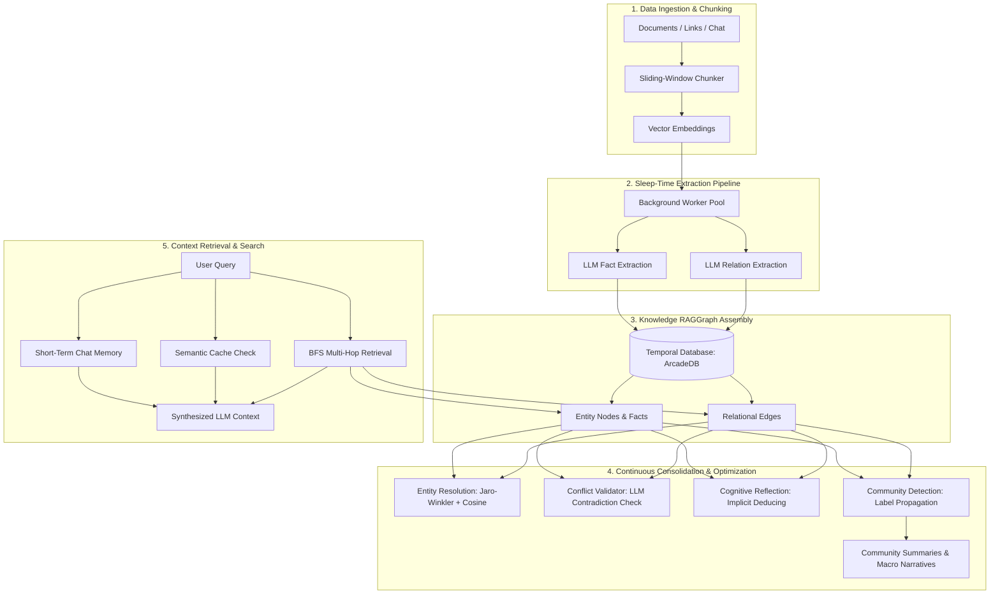

# Multi-Agent Swarm Memory System

A high-performance, low-latency long-term memory layer for AI agents and multi-agent swarms written in **Golang**. This system fuses semantic vector search, temporal relational schemas, and asynchronous cognitive processing to enable autonomous agents to maintain state, recall user preferences, and resolve conflicts over time.

Pulse is built using a database abstraction layer that natively supports **ArcadeDB**.

---

## The Knowledge RAGGraph Lifecycle

The **RAGGraph** is a dynamic, unified property graph and vector memory space designed for high-performance retrieval and continuous semantic optimization. It fuses structural, relational graph knowledge with semantic vector space in ArcadeDB.



### 1. Ingestion & Chunking
Documents (PDFs, Markdown), URLs, or live chat conversations are ingested and parsed. A recursive sliding-window chunker divides the text (typically 1000 characters with a 200-character overlap) and generates dense vector embeddings.

### 2. Sleep-Time Cognitive Extraction
Using the decoupled async worker pool ("Sleep-Time Pattern"), background workers process the ingested text via LLM routines to isolate:
* **Entity Nodes:** Vertices representing people, objects, organizations, or concepts.
* **Factual Attributes:** Key-value factual properties (e.g., `preferred_cloud: Google Cloud`) attached to entities.
* **Relational Edges:** Typed directional edges (e.g., `WORKS_AT`, `FRIEND_OF`) connecting entity nodes.

### 3. Graph Assembly & Temporal Binding
Nodes, attributes, and relationships are written to ArcadeDB. Every element is bound by temporal properties (`valid_from` and `valid_until`). Instead of physically deleting old data, contradictions or revisions soft-deactivate old facts by updating `valid_until`.

### 4. Continuous Consolidation & Optimization
As the graph grows, background loops continuously audit and refine graph state:
* Resolving duplicate entities using typographic and semantic similarity.
* Evaluating logical contradictions via LLM-in-the-loop checks.
* Generating community clusters via label propagation and synthesizing global macro narratives.

### 5. Context Retrieval
When a query arrives, the system retrieves short-term chat logs, executes a semantic cache lookup, and runs a Breadth-First Search (BFS) relation traversal to retrieve localized graph facts. These sources are compiled into a comprehensive prompt context.

---

## Memory Techniques & Processing Layers

Pulse orchestrates a multi-layered memory paradigm to emulate human cognition and support low-latency agent context assembly:

### 1. Short-Term Transient Chat Memory
* **Purpose:** Maintains immediate conversational state across stateless HTTP calls.
* **Implementation:** Built on Redis or Valkey (with a thread-safe in-memory map fallback) with a 24-hour TTL, storing the last 50 messages. During asynchronous consolidation, the last 10 messages are loaded to resolve context and pronouns (e.g., mapping "she" to a resolved entity "Emily").

### 2. Semantic Long-Term Vector Memory
* **Purpose:** Matches current queries with relevant historical facts based on semantic meaning.
* **Implementation:** Long-term facts are stored as vector embeddings in the graph database. Similarity is evaluated using Cosine Similarity on query embeddings.

### 3. Temporal Relational Modeling
* **Purpose:** Track history and update fact states without losing records.
* **Implementation:** Facts store `valid_from` and `valid_until` timestamps. If a singular property (like `current_role`) changes, the older active fact is soft-deactivated, keeping history intact while ensuring the active state remains contradiction-free.

### 4. Decoupled Asynchronous Consolidation (Sleep-Time Pattern)
* **Purpose:** Keeps user-facing chat interactions in the millisecond range.
* **Implementation:** Chat endpoints retrieve existing memory and reply immediately. The interaction is pushed to an asynchronous task queue. Background workers perform resource-heavy LLM extraction, conflict check, and graph write actions.

### 5. Semantic Cache (Hybrid RAM & Redis)
* **Purpose:** Bypasses LLM generation for semantically identical or repeated queries.
* **Implementation:** Computes query vector and compares it against hot in-memory cache entries. If similarity exceeds a threshold (defaults to 0.95), cached responses are returned instantly. Hot memory cache is backed by Redis persistence.

### 6. Logical Conflict Validation (LLM-in-the-Loop)
* **Purpose:** Identifies complex contradictions that simple key-matching cannot detect.
* **Implementation:** Extracted candidate facts are passed to the `ConflictValidator` alongside existing active facts of the entity. The LLM performs logical reasoning to audit contradictions (e.g., "likes tea" vs "allergic to tea"). If verified, conflicting active records are soft-deactivated.

### 7. Entity Resolution (Hybrid Typographic & Semantic Similarity)
* **Purpose:** Prevents graph fragmentation from spelling variations or synonyms.
* **Implementation:** A background loop runs periodically to detect matches (threshold $\ge 0.93$) using a hybrid similarity score: 60% semantic similarity (name embeddings cosine score) + 40% typographic similarity (Jaro-Winkler string distance). Merging fuses nodes, re-mapping edges and facts to the canonical node.

### 8. Cognitive Reflection & Insight Deducing
* **Purpose:** Synthesizes higher-level insights that were never explicitly stated.
* **Implementation:** A periodic background routine analyzes active facts and relations of an entity. An LLM acts as a cognitive reflection engine, deducing implicit insights (e.g., deducing "implied_career_focus: Go Developer" from facts about coding and Cloud preferences) and storing them back as new reflection facts.

### 9. Community GraphRAG & Macro-Narrative Summarization
* **Purpose:** Answers high-level, global queries about clusters of related entities.
* **Implementation:** Uses Label Propagation Algorithm (LPA) to partition the entity relationship graph into communities. An LLM synthesizes "Macro Narrative Summaries" for each community, which are embedded and stored for vector-based global context retrieval.

### 10. BFS Multi-Hop Traversal (GraphRAG)
* **Purpose:** Gathers rich contextual context across multiple relational connections.
* **Implementation:** Performs a Breadth-First Search (BFS) up to $K$ hops (defaults to 2) starting from the seed entity. Connected entity facts along the traversal path are appended to the context.

### 11. Provenance Swarm Linking
* **Purpose:** Establishes a transparent chain of evidence for consolidated facts.
* **Implementation:** Facts extracted from ingested documents are linked via native edges back to the specific text chunk and source document node, providing source attribution.

---

## Prerequisites

Ensure you have installed ArcadeDB:

* **Go Runtime:** Version 1.26 or higher.
* **LLM API Key:** Get a key from [Google AI Studio](https://aistudio.google.com/) for Gemini, or [OpenAI Platform](https://platform.openai.com/) for OpenAI.
* **Active Database Instance:**
  * **ArcadeDB:** A running ArcadeDB server instance (HTTP API port 2480).
* **Short-Term Chat Memory (Optional):** Redis server version 6.x+ or Valkey version 7.x+ (falls back to a thread-safe in-memory map if none is provided).

---

## Getting Started

### 1. Configure Environment Variables
Copy the `.env.example` file to `.env` in the root of the project:
```bash
cp .env.example .env
```

Open the `.env` file and configure the database provider along with your active LLM provider choice:

```env
# ArcadeDB Graph/Document Database Settings
ARCADEDB_URL=http://localhost:2480
ARCADEDB_DATABASE=pulse
ARCADEDB_USERNAME=root
ARCADEDB_PASSWORD=playwithdata

# Choose your active LLM provider: gemini | openai
LLM_PROVIDER=gemini

# Gemini API Settings (if using gemini)
GEMINI_API_KEY=AIzaSy...
GEMINI_GENERATION_MODEL=gemini-2.5-flash
GEMINI_EMBEDDING_MODEL=gemini-embedding-001

# OpenAI API Settings (if using openai)
OPENAI_API_KEY=sk-...
OPENAI_GENERATION_MODEL=gpt-4o-mini
OPENAI_EMBEDDING_MODEL=text-embedding-3-small

# Short-Term Chat Memory Configuration
# Choose active provider: redis | valkey | in-memory
CHAT_MEMORY_PROVIDER=redis
CHAT_MEMORY_URL=localhost:6379

PORT=8080
```

### 2. Run the Server
Launch the HTTP server. It will connect to your database, run transactional schema initialization commands (creating tables, node constraints, or vector indexes), and start listening:
```bash
make run
```

---

## API Specification

### 1. Chat with Memory Context (`POST /chat`)
Sends a message to the agent, retrieves relevant long-term context, incorporates short-term chat history, and schedules the conversation log for background memory consolidation.

Short-term chat history (up to the last 15 messages) is automatically loaded and fed into the model along with similarity-retrieved long-term memory cells. The new message and its reply are appended to the short-term cache. Additionally, the asynchronous background worker pool retrieves the last 10 messages from short-term memory to resolve pronouns and context during consolidation.

* **Headers:** `Content-Type: application/json`
* **Request Body:**
```json
{
  "session_id": "848e02d6-44ea-4c47-9750-b0ff2c4d9a1f",
  "entity_id": "c33f20d5-5d9c-4972-bb2f-34d380963579",
  "agent_role": "developer_agent",
  "message": "Hey, I prefer coding backend APIs in Golang and deploying them to Google Cloud. My phone is +1-555-0199.",
  "includeFacts": true
}
```
* **Response Body (when facts are requested via `includeFacts` or `includeFachs`):**
```json
{
  "responseMessage": "Got it! Since you prefer coding backend APIs in Golang and deploying them on Google Cloud, I will keep that in mind for future reference.",
  "entityFacts": [],
  "documentFacts": []
}
```
* **Response Body (when facts are NOT requested):**
```json
{
  "responseMessage": "Got it! Since you prefer coding backend APIs in Golang and deploying them on Google Cloud, I will keep that in mind for future reference."
}
```
*(Note: PII like phone numbers will be automatically scrubbed locally as `[PHONE_REDACTED]` before database writing or API query).*

---

### 2. Register Graph Relationship (`POST /relation`)
Inserts a deterministic relationship edge between two entities inside the temporal knowledge graph.

* **Headers:** `Content-Type: application/json`
* **Request Body:**
```json
{
  "source_id": "c33f20d5-5d9c-4972-bb2f-34d380963579",
  "target_id": "d82f71d1-678a-4934-bc2c-55c320963628",
  "type": "works_at"
}
```
* **Response Body (Status 201):**
```json
{
  "status": "success"
}
```

---

### 3. Service Health Check (`GET /health`)
Verifies the operational status of the service.

* **Response Body (Status 200):**
```
ok
```

---

### 4. Ingest Local File (`POST /ingest/file`)
Uploads a local PDF or Markdown file, saves it to upload cache, and posts an ingestion task to the background worker.

* **Headers:** `multipart/form-data`
* **Form Parameters:**
  * `file`: Binary file data. Must end in `.pdf`, `.md`, or `.markdown`.
  * `title`: Optional custom title.
  * `entity_id`: Optional target entity ID.
* **Response Body (Status 202):**
```json
{
  "document_id": "f8a0322c-7b44-4869-9069-b54157833502",
  "status": "pending",
  "message": "Document file uploaded and queued for processing"
}
```

---

### 5. Ingest Web Link or Google Doc (`POST /ingest/link`)
Submits a public web page or Google Docs URL for background crawling and parsing.

* **Headers:** `Content-Type: application/json`
* **Request Body:**
```json
{
  "url": "https://docs.google.com/document/d/1v.../edit",
  "title": "System Design Specifications",
  "source_type": "google_docs",
  "entity_id": "8be26355-552c-4f85-9a0f-4cd50660dae5"
}
```
* **Response Body (Status 202):**
```json
{
  "document_id": "b3e34b99-3171-46da-b78f-aef6eb3907c1",
  "status": "pending",
  "message": "Link queued for background fetch and parsing"
}
```

---

### 6. Get Ingestion Status (`GET /documents/{id}`)
Retrieves parsing metrics, document status, and processing logs.

* **Response Body (Status 200):**
```json
{
  "id": "b3e34b99-3171-46da-b78f-aef6eb3907c1",
  "title": "System Design Specifications",
  "source_type": "google_docs",
  "source_url": "https://docs.google.com/document/d/1v.../edit",
  "status": "completed",
  "error_message": "",
  "metadata": {
    "page_count": "14",
    "author": "Jane Doe"
  },
  "created_at": "2026-05-31T16:44:19Z",
  "updated_at": "2026-05-31T16:45:02Z"
}
```

---

### 7. Search Ingested Documents (`POST /search/documents`)
Performs a semantic vector search across all stored document chunks using cosine similarity.

* **Headers:** `Content-Type: application/json`
* **Request Body:**
```json
{
  "query": "What database provider limit configurations are defined?",
  "limit": 3
}
```
* **Response Body (Status 200):**
```json
{
  "results": [
    {
      "document_id": "b3e34b99-3171-46da-b78f-aef6eb3907c1",
      "chunk_index": 3,
      "content": "Pgvector HNSW vector indexes have a 2000 dimension limit, which is why exact sequential scanning is configured.",
      "score": 1.0
    }
  ]
}
```

---

## Interactive Chat Client

Pulse includes a terminal-based interactive chat interface for real-time memory retrieval testing:
```bash
# Run without facts returned in the chat responses (default)
./scripts/test_client.sh

# Run with facts returned and printed in the terminal
./scripts/test_client.sh --facts
```

This client initiates a dynamic conversation, logs retrieved long-term memory cells from your database (if facts are requested via `--facts`, `--include-facts` or `-f`), and supports live edge writing shortcuts:
* `/relation <type> <target_id>` (Creates a graph relationship between you and a target node)
* `/exit` (Terminates the CLI session)
